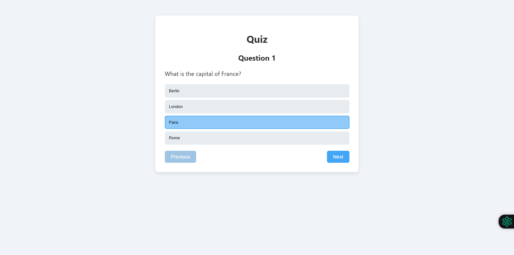

# 🎯 QUIZAPP - React Quiz Application

A simple interactive quiz application built with React and Vite. Test your knowledge with 3 fun questions!


## ✨ Features

- ✅ 3 multiple-choice questions
- ✅ Navigate between questions with Previous/Next buttons
- ✅ Select and change answers anytime
- ✅ View results at the end with correct/incorrect answers
- ✅ Option to restart the quiz and play again
- ✅ Clean and responsive design

## 🛠️ Built With

- [React](https://reactjs.org/) - JavaScript library for user interfaces
- [Vite](https://vitejs.dev/) - Next generation frontend tooling
- CSS - For styling components

## 📁 Project Structure

```
quizapp/
├── public/
├── src/
│   ├── assets/
│   ├── components/
│   │   ├── quiz.jsx        # Main quiz logic and navigation
│   │   └── results.jsx     # Results display component
│   ├── App.jsx             # Root component
│   ├── index.css           # Global styles
│   └── main.jsx            # Entry point
├── .gitignore
├── index.html
├── package.json
├── README.md
└── vite.config.js
```

## 🎮 Quiz Questions

The quiz includes the following questions:

1. **What is the capital of France?**
   - Options: Berlin, London, Paris, Rome
   - Correct answer: Paris

2. **Which language is used for web apps?**
   - Options: PHP, Python, JavaScript, All
   - Correct answer: All

3. **What does JSX stand for?**
   - Options: JavaScript XML, Java Syntax eXtension, Just a Simple eXample, None of the above
   - Correct answer: JavaScript XML

## 🚀 How to Run Locally

Follow these steps to run the application on your local machine:

```bash
# Clone the repository
git clone https://github.com/YOUR_USERNAME/quizapp.git

# Navigate to project folder
cd quizapp

# Install dependencies
npm install

# Start development server
npm run dev
```

The application will open at `http://localhost:5173`

## 🎯 How to Play

1. **Select an answer** - Click on one of the option buttons
2. **Navigate** - Use "Previous" and "Next" buttons to move between questions
3. **Finish** - On the last question, click "Finish Quiz" to see your results
4. **Restart** - Click "Try Again" to play the quiz once more

## 📊 State Management

The application uses React hooks for state management:
- `useState` for tracking user answers, current question, and quiz completion
- Answers are stored in an array: `[answer1, answer2, answer3]`

## 📸 Screenshots

### Quiz Question View


### Results View


## 🔮 Future Improvements

- Add more questions
- Implement a timer for each question
- Add different categories
- Save high scores in localStorage
- Add animations and transitions

## 📝 License

This project is open source and available under the MIT License.

## 👩‍💻 Author

Your Name
- GitHub: [@YOUR_USERNAME](https://github.com/mirela2302)

## 🙏 Acknowledgments

- Special thanks to **[Pedro Machado](https://github.com/machadop1407)** for his comprehensive React tutorial that guided me through building this quiz application. His clear explanations and structured approach made learning React enjoyable and accessible.
- Built with [Vite](https://vitejs.dev/) - an amazing build tool that makes React development a breeze